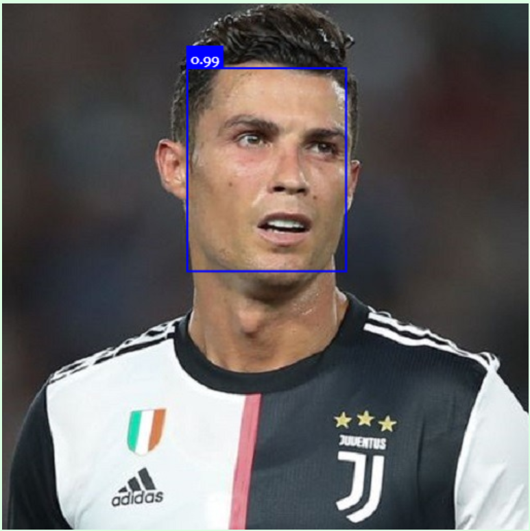
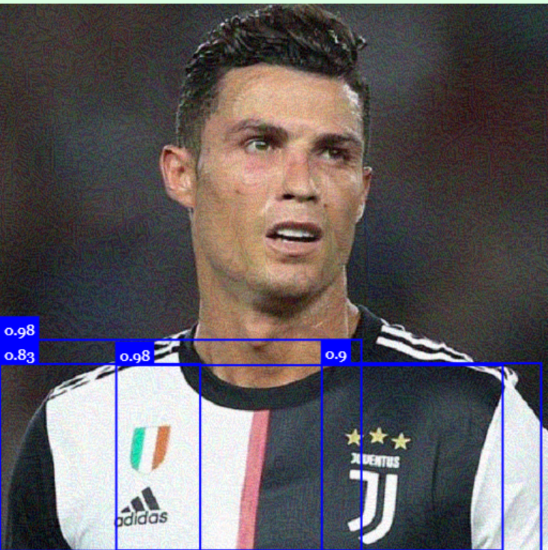
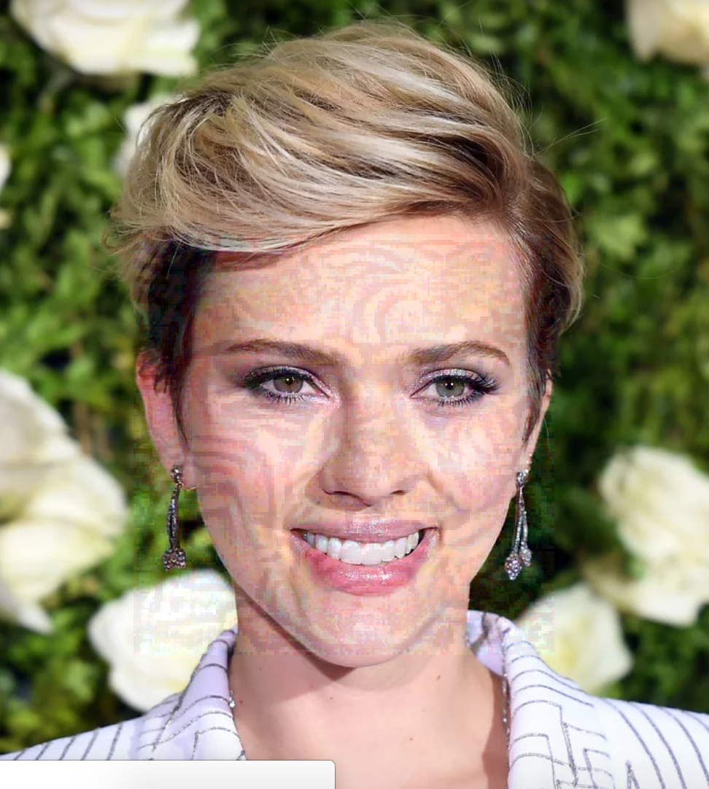

# Face/Off

Find the report [here](https://github.com/mahdiabdollahpour/mahdiabdollahpour.github.io/blob/master/files/Internship_Report.pdf) and sample outputs [here](https://github.com/mahdiabdollahpour/mahdiabdollahpour.github.io/blob/master/files/Face_Off_Report_compressed.pdf)

In Face/Off, we strive to protect the privacy of social media users by performing black-box adversarial attacks to obscure their images in a way that is difficult for machine learning algorithms to accurately interpret and recognize their face, yet still preserves their visual appearance for human viewers.

There are two approaches that we have taken in this context: attacking face detection and attacking face recognition models.

## 1. Attacking face detection models

The local face detector used is the <b>SSD MobileNet V1</b>, which is a single-shot multi-box detector that utilizes MobileNet as its base model. The SSD algorithm has a higher coverage of bounding boxes compared to YOLO (You Only Look Once), but it comes at the cost of lower processing speed.
To perform a targeted attack, <b>projected gradient descent</b> is used to minimize the overlap between the areas detected by the model and the actual areas of faces in the image. The loss function we first used is:

$$loss_{detection} = -\sum_{b \in boxes} score_b * (sign(d_b-t)),$$

in which $d_b$ is the distance of detected box $b$ from the actual position of the face and $t$ is a threshold. $score_b$ is the probability that $b$ includes a face, predicted by the model. By optimizing this loss, the real face was successfully undetected by the local model but the new fake detected boxes were small. To make fake boxes bigger, we optimize the following loss that considers the area of generated boxes:

$$loss_{detection} = -\sum_{b \in boxes} score_b * area_b * (sign(d_b-t))$$

Here is an example of an image and its perturbed version after it was subjected to this attack. You can see that the perturbed image looks slightly different from the original, but it still retains some of the key features of the original image, and the detector model cannot detect the actual face.
   

## 2. Attacking face recognation models

The <b>FaceNet</b> model is used to represent images in a compact, feature-rich space known as the latent space. FaceNet is based on <b>InceptionResnetV1</b> architecture. We can then measure the similarity between two faces by calculating the dot product of their embeddings in this latent space. To impersonate a particular target person, we are applying <b>projected gradient descent</b> with <b>momentum</b> to perturb the image so that its embedding closely matches that of the target person's face. To be able to apply the attack on black-box models we have used <b>image augmentation</b> techniques such as random cropping, random scaling, and random uniform noise.

Here are three modified versions of a celebrity image with different levels of perturbation. Epsilon is a measure of how much the perturbation deviates from the original image in the process of projected gradient descent, and a smaller epsilon value means that the perturbation will be kept closer to the original image. The following perturbations were made using epsilon values of 8, 12, and 16.

We used two online face recognition tools, BetaFace and Clarifai, to evaluate our model and achieved a success rate of 35%. In the previous example, we were able to fool both tools using all three epsilon values, except for epsilon 8 on BetaFace.

## Setup

Download the weights for the pre-trained FaceNet model from [this link](https://drive.google.com/file/d/1VahZ8rC43DLkat-AZTW1jx0SFapi2hiG/view?usp=sharing) and place them in the './models/Inception-resnet' directory.
